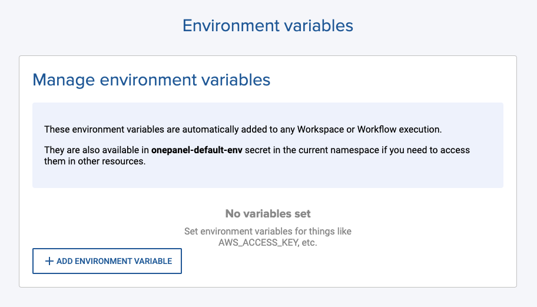

Environment variables are unique to each namespace and will be automatically added to any running Workspace or Workflow Task.

The following system environment variables are always automatically added to both Workspaces and Workflow containers:

- `ONEPANEL_API_URL` Platform API URL that can be used to make SDK or API calls from any container.
- `ONEPANEL_FQDN` Fully qualified domain name (FQDN) where platform UI and API is installed. Example: `app.sub.domain.com`
- `ONEPANEL_DOMAIN` Domain name where the platform is installed. Example: `sub.domain.com`
- `ONEPANEL_RESOURCE_NAMESPACE` The namespace where the resource is running.
- `ONEPANEL_RESOURCE_UID` The unique ID of the resource in namespace.

You can add your own environment variables by navigating to the **Settings** menu and clicking **Add environment variable**.

