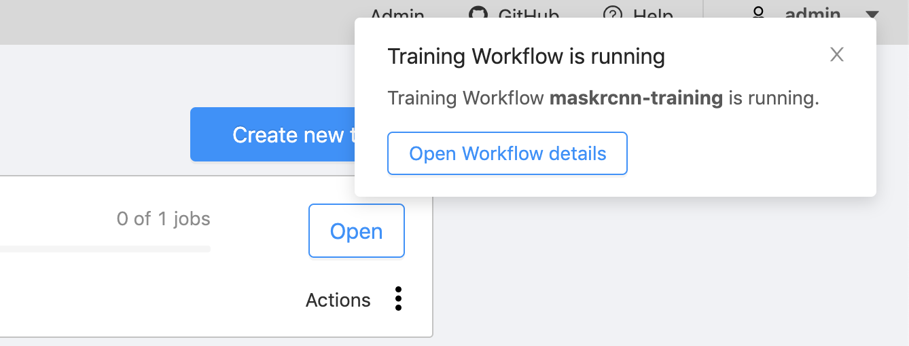

import Tabs from '@theme/Tabs';
import TabItem from '@theme/TabItem';

It's easy to get started with Onepanel. First, you install the CLI (`opctl`) and then using `opctl`, you generate a `params.yaml` file and update it to configure your deployment. Once complete, you can access your deployment from any browser.

In this quick start, we will walk you through:

1. Deploying Onepanel to one of the major cloud providers or locally on MicroK8s.
2. Labelling your images or video using the integrated annotation Workspace.
3. Training your model with the newly labelled data using the integrated training Workflows.
4. Automatically annotating new data using your newly trained model.

Before getting started, take a look at [concepts](/docs/getting-started/concepts/namespaces) to understand the different components in Onepanel.

:::tip
You can also follow along with our getting started videos, but be sure to use the commands from the docs:

- [Getting started with Microsoft Azure](https://youtu.be/zwJM5T00qpA)
- [Getting started with Amazon EKS](https://youtu.be/2LlOrVIrzzQ)
- [Getting started with Google Cloud GKE](https://youtu.be/YKSOiTgpwXk)
:::

## Step 0: Create a Kubernetes cluster
Let's get started by creating a Kubernetes cluster in one of the major cloud providers or locally with MicroK8s:

<Tabs
  groupId="cloud-provider"
  defaultValue="aks"
  values={[
    { label: 'Azure AKS', value: 'aks', },
    { label: 'Amazon EKS', value: 'eks', },
    { label: 'Google Cloud GKE', value: 'gke', },
    { label: 'MicroK8s', value: 'microk8s', },
  ]
}>
<TabItem value="aks">

:::important
Make sure the **latest version** of [Azure CLI](https://docs.microsoft.com/en-us/cli/azure/install-azure-cli?view=azure-cli-latest) (`az`) is installed before proceeding.
:::

Run this `az` command to create a bare minimum cluster with 2 `Standard_D4s_v3` nodes:

```bash
az aks create --resource-group <resource-group> --name <cluster-name> --location <region> \
    --node-count 2 \
    --node-vm-size Standard_D4s_v3 \
    --node-osdisk-size 100 \
    --min-count 2 \
    --max-count 5 \
    --enable-cluster-autoscaler \
    --network-plugin azure \
    --network-policy azure \
    --enable-addons monitoring \
    --generate-ssh-keys
```

You can then get access credentials by running:

```bash
az aks get-credentials --resource-group <resource-group> --name <cluster-name> --admin
```

</TabItem>
<TabItem value="eks">

:::important
Make sure the **latest version** of [Amazon EKS CLI](https://docs.aws.amazon.com/eks/latest/userguide/getting-started-eksctl.html) (`eksctl`) is installed before proceeding.
:::

Run this `eksctl` commands to create a bare minimum cluster with 2 `m5.xlarge` nodes:

```bash
eksctl create cluster --name=<cluster-name> --region <region> --zones <<region>a>,<<region>b> --node-zones <<region>a> \
    --nodes 2  \
    --node-type m5.xlarge \
    --node-volume-size 100 \
    --nodes-min 2 \
    --nodes-max 5 \
    --asg-access \
    --ssh-access \
    --managed=false \
    --tags "onepanel.io/enabled=true,k8s.io/cluster-autoscaler/node-template/label/node.kubernetes.io/instance-type=m5.xlarge"
```

:::note 
In order to [support scale to and from zero](https://github.com/aws/containers-roadmap/issues/724), we need to use EKS unmanaged nodes. These do not show up in EKS console but you can view them by going to **EC2** > **Auto Scaling groups**.
:::

The `eksctl` command above will automatically retrieve your cluster's access credentials but you can also get them by running:

```bash
eksctl utils write-kubeconfig --cluster=<cluster-name> --region <region>
```

If you want to give another user admin access to this cluster after creation:

```bash
eksctl create iamidentitymapping --cluster <cluster-name> --arn arn:aws:iam::<number>:user/<username> --group system:masters --username <username>
```

We also recommend enabling CloudWatch monitoring as follows:

```bash
eksctl utils update-cluster-logging --enable-types all
```

</TabItem>
<TabItem value="gke">

:::important
Make sure the **latest version** of [Google Cloud SDK](https://cloud.google.com/sdk/install) (`gcloud`) is installed before proceeding.
:::

Run this `gcloud` command to create a bare minimum cluster with 2 `n1-standard-4` nodes:

```bash
gcloud container --project <project-name> clusters create <cluster-name> --zone <zone> --node-locations <zone> \
    --num-nodes 2 \
    --machine-type n1-standard-4 \
    --disk-size 100 \
    --min-nodes 2 \
    --max-nodes 5 \
    --enable-autoscaling \
    --enable-network-policy \
    --enable-stackdriver-kubernetes \
    --addons HorizontalPodAutoscaling,HttpLoadBalancing
```

The command above will automatically retrieve your cluster's access credentials but you can also get them by running:

```
gcloud container clusters get-credentials <cluster-name> --zone <zone>
```
</TabItem>

<TabItem value="microk8s">

:::important
MicroK8s deployment is currently only supported on Ubuntu 20.04 or higher running as host OS on a local cluster.

See [MicroK8s on remote machines](/docs/deployment/configuration/remote-microk8s) for reference if you are deploying to a remote VM or using Multipass.
:::

1. First, install `microk8s`.

    ```bash
    sudo snap install microk8s --channel=1.19/stable --classic
    ```

2. Make sure your current user has permissions to work with `microk8s`.

    ```bash
    sudo usermod -a -G microk8s $USER
    sudo chown -f -R $USER ~./kube
    ```

   :::note
   You will have restart your machine for this change to take effect.
   :::

   Wait for it to be ready.

   ```bash
   microk8s status --wait-ready
   ```

3. Enable the following required add-ons:

    ```bash
    sudo microk8s enable storage dns rbac
    ```

4. Enable TokenRequest feature (required by Istio) by passing in extra arguments to the api server.
    ```shell script
    sudo nano /var/snap/microk8s/current/args/kube-apiserver
    ```

   Add these lines:
    ```text
    --service-account-signing-key-file=${SNAP_DATA}/certs/serviceaccount.key
    --service-account-key-file=${SNAP_DATA}/certs/serviceaccount.key
    --service-account-issuer=api
    --service-account-api-audiences=api,nats
    ```
   Make sure this line is set to these values:
    ```text
    --authorization-mode=RBAC,Node
    ```

   Save your changes.

5. Restart daemon-apiserver for changes to take effect

    ```bash
    sudo systemctl restart snap.microk8s.daemon-apiserver
    ```

   Check microk8s is running with
   ```bash
   microk8s status --wait-ready
   ```

</TabItem>
</Tabs>

:::tip
Once you are done with these quick start steps, see [adding more nodes](/docs/deployment/components/nodes) to add additional CPU or GPU nodes to your cluster.
:::

## Step 1: Install Onepanel

1. Download the latest `opctl` for your operating system from [our release page](https://github.com/onepanelio/core/releases/latest).

  <Tabs
    groupId="operating-systems"
    defaultValue="linux"
    values={[
      { label: 'Linux', value: 'linux', },
      { label: 'macOS', value: 'macos', },
      { label: 'Windows', value: 'windows', },
      { label: 'MicroK8s', value: 'microk8s', },
    ]
  }>

  <TabItem value="linux">

  ```bash
  # Download the binary
  curl -sLO https://github.com/onepanelio/core/releases/latest/download/opctl-linux-amd64

  # Make binary executable
  chmod +x opctl-linux-amd64

  # Move binary to path
  mv ./opctl-linux-amd64 /usr/local/bin/opctl

  # Test installation
  opctl version
  ```

  </TabItem>
  <TabItem value="macos">

  ```bash
  # Download the binary
  curl -sLO https://github.com/onepanelio/core/releases/latest/download/opctl-macos-amd64

  # Make binary executable
  chmod +x opctl-macos-amd64

  # Move binary to path
  mv ./opctl-macos-amd64 /usr/local/bin/opctl

  # Test installation
  opctl version
  ```

  </TabItem>
  <TabItem value="windows">

  :::info
  Download the [attached executable](https://github.com/onepanelio/core/releases/latest/download/opctl-windows-amd64.exe), rename it to `opctl` and move it to a folder that is in your PATH environment variable.
  :::

  </TabItem>

  <TabItem value="microk8s">

  ```bash
  # Download the binary
  curl -sLO https://github.com/onepanelio/core/releases/latest/download/opctl-linux-amd64

  # Make binary executable
  chmod +x opctl-linux-amd64

  # Move binary to path
  mv ./opctl-linux-amd64 /usr/local/bin/opctl

  # Test installation
  opctl version
  ```

  </TabItem>
  </Tabs>

2. Run the following command to initialize a `params.yaml` template for your provider:

  <Tabs
    groupId="cloud-provider"
    defaultValue="aks"
    values={[
      { label: 'Azure AKS', value: 'aks', },
      { label: 'Amazon EKS', value: 'eks', },
      { label: 'Google Cloud GKE', value: 'gke', },
      { label: 'MicroK8s', value: 'microk8s', },
    ]
  }>
  <TabItem value="aks">

  ```bash
  opctl init --provider aks \
    --artifact-repository-provider abs \
    --gpu-device-plugins nvidia
  ```

  </TabItem>
  <TabItem value="eks">

  ```bash
  opctl init --provider eks \
    --artifact-repository-provider s3 \
    --gpu-device-plugins nvidia
  ```

  </TabItem>
  <TabItem value="gke">

  ```bash
  opctl init --provider gke \
    --artifact-repository-provider gcs \
    --gpu-device-plugins nvidia
  ```

  </TabItem>

  <TabItem value="microk8s">

  ```bash
  opctl init --provider microk8s \
             --enable-metallb \
             --artifact-repository-provider abs
  ```
  </TabItem>
  </Tabs>

  :::note
  Currently, valid options for `--artifact-repository-provider` flag are `s3`, `gcs` and `abs`. 
  
  The `s3` option supports [Amazon S3](https://aws.amazon.com/s3/) and any S3 compatible object storage like [Minio](https://docs.min.io/).
  
  The `gcs` option supports [Google Cloud Storage](https://cloud.google.com/storage/).

  The `abs` option supports [Azure Blob Storage](https://azure.microsoft.com/en-us/services/storage/blobs/).
  :::

3. Populate `params.yaml` by following the instructions in the template, and referring to [configuration file sections](/docs/deployment/configuration/files#sections) for more detailed information.

4. Label your nodes if applicable.

  <Tabs
  groupId="cloud-provider"
  defaultValue="aks"
  values={[
  { label: 'Azure AKS', value: 'aks', },
  { label: 'Amazon EKS', value: 'eks', },
  { label: 'Google Cloud GKE', value: 'gke', },
  { label: 'MicroK8s', value: 'microk8s', },
  ]
  }>
  <TabItem value="aks">
  
  Azure AKS automatically labels nodes with `node.kubernetes.io/instance-type=<cloud-provider-instance-type>`.
  
  </TabItem>
  <TabItem value="eks">

  Amazon EKS automatically labels nodes with `node.kubernetes.io/instance-type=<cloud-provider-instance-type>`.

  </TabItem>
  <TabItem value="gke">

  Google Cloud GKE automatically labels nodes with `node.kubernetes.io/instance-type=<cloud-provider-instance-type>`.

  </TabItem>

  <TabItem value="microk8s">

  To allow Workspaces to run on your machine(s) you need to label them.
  
  First, get the names of your nodes by running:

  ```bash
  microk8s kubectl get nodes
  ```

  You will get results similar to below:

  ```bash
  NAME     STATUS   ROLES    AGE   VERSION
  sample   Ready    <none>   11m   v1.19.8-34+811e9feeade1d3
  ```

  Then, for each node name, add the label from your `application.nodePool.label` from your `params.yaml`, for example if you have:
  
  ```yaml
  nodePool:
      label: node.kubernetes.io/instance-type
      options:
        - name: 'Local machine'
          value: local
  ```
  
  and the node above is called `sample`, you can label the node as follows:
  
  ```bash
  microk8s kubectl label node sample node.kubernetes.io/instance-type=local
  ```

  </TabItem>
  </Tabs>

5. Run the following command to deploy Onepanel to your cluster:

  <Tabs
    groupId="cloud-provider"
    defaultValue="aks"
    values={[
      { label: 'Azure AKS', value: 'aks', },
      { label: 'Amazon EKS', value: 'eks', },
      { label: 'Google Cloud GKE', value: 'gke', },
      { label: 'MicroK8s', value: 'microk8s', },
    ]
  }>
  <TabItem value="aks">

  ```bash
  opctl apply
  ```

  </TabItem>
  <TabItem value="eks">

  ```bash
  opctl apply
  ```

  </TabItem>
  <TabItem value="gke">

  ```bash
  opctl apply
  ```

  </TabItem>

  <TabItem value="microk8s">

  ```bash
  microk8s config > kubeconfig
  KUBECONFIG=./kubeconfig opctl apply
  ```

  </TabItem>
  </Tabs>

  :::note
  If the command completes but it indicates that your cluster is not ready, you can check status again by running `opctl app status`. If you're still seeing issues, visit our [Troubleshooting](/docs/deployment/troubleshooting/overview) page.
  :::

6. Once the deployment completes, the CLI will display the host name and wildcard domain you need to use to setup your DNS. You can also get this information again by running:

  <Tabs
      groupId="cloud-provider"
      defaultValue="aks"
      values={[
      { label: 'Azure AKS', value: 'aks', },
      { label: 'Amazon EKS', value: 'eks', },
      { label: 'Google Cloud GKE', value: 'gke', },
      { label: 'MicroK8s', value: 'microk8s', },
      ]
  }>
  <TabItem value="aks">

    ```bash
    opctl app status
    ```

    Create the appropriate DNS record in your DNS provider based on the instructions above.
    
    Wait a few minutes and check the URL mentioned in the instructions above. Your applications should load with a screen prompting you to enter a token.

  </TabItem>

  <TabItem value="eks">

    ```bash
    opctl app status
    ```

    Create the appropriate DNS record in your DNS provider based on the instructions above.
    
    Wait a few minutes and check the URL mentioned in the instructions above. Your applications should load with a screen prompting you to enter a token.

  </TabItem>

  <TabItem value="gke">

    ```bash
    opctl app status
    ```

    Create the appropriate DNS record in your DNS provider based on the instructions above.
    
    Wait a few minutes and check the URL mentioned in the instructions above. Your applications should load with a screen prompting you to enter a token.

  </TabItem>
  
  <TabItem value="microk8s">

    With a local deployment, you may also need to set up DNS locally. Follow the instructions below to do this using [Dnsmasq](https://thekelleys.org.uk/dnsmasq/doc.html).

    Run the following command:

    ```bash
    KUBECONFIG=./kubeconfig opctl app status
    ```

    You'll get a similar output to below:

    ```text
    In your DNS, add an A record for *.onepanel.test and point it to '198.168.99.0'
    Once complete, your application will be running at https://app.onepanel.test
    ```

    Record the IP address, `198.168.99.0` and the domain `*.onepanel.test`.

    Then, follow the instructions at [Local DNS with Dnsmasq](/docs/deployment/configuration/dns) to set up local DNS.

  </TabItem>
  </Tabs>

6. Use the following command to get your auth token to log into Onepanel:

  <Tabs
  groupId="cloud-provider"
  defaultValue="aks"
  values={[
  { label: 'Azure AKS', value: 'aks', },
  { label: 'Amazon EKS', value: 'eks', },
  { label: 'Google Cloud GKE', value: 'gke', },
  { label: 'MicroK8s', value: 'microk8s', },
  ]
  }>
  <TabItem value="aks">

  ```bash
  opctl auth token
  ```

  </TabItem>
  <TabItem value="eks">

  ```bash
  opctl auth token
  ```

  </TabItem>
  <TabItem value="gke">

  ```bash
  opctl auth token
  ```

  </TabItem>
  <TabItem value="microk8s">

  ```bash
  microk8s config > kubeconfig
  KUBECONFIG=./kubeconfig opctl auth token
  ```

  </TabItem>
  </Tabs>

:::note
If the application is not loading, visit our [Troubleshooting](/docs/deployment/troubleshooting/overview) page for some steps that can help resolve most issues. If you are still having issues, reach out in [Slack](https://join.slack.com/t/onepanel-ce/shared_invite/zt-eyjnwec0-nLaHhjif9Y~gA05KuX6AUg) or [GitHub discussions](https://github.com/onepanelio/core/discussions).
:::

:::important
You will most likely need to use a GPU node pool for **Step 3: Train a model on annotated data** below. See [adding more nodes](/docs/deployment/components/nodes) for instructions on adding GPU node pools to your cluster.
:::

## Step 2: Annotate your data

Onepanel is fully integrated with [Computer Vision Annotation Tool (CVAT)](https://github.com/opencv/cvat), allowing you to annotate images and videos and then train models on the annotated data with a few clicks. You can then use these newly trained models to automatically pre-annotate additional data, iteratively improving your object detection or semantic segmentation models.

1. Go to **Workspaces** and click **Create Workspace**.

  

2. Select the CVAT template and enter a name for your Workspace.

  

3. Select a node pool that Onepanel will use to provision a machine for running CVAT. CVAT requires at least 16GB of RAM.
  
  
  
  :::note
  Some providers have limits on how many volumes you can attach to a node. The default CVAT template in Onepanel requires 3 volumes, so make sure to pick a machine that can support at least that many volumes.
  :::

4. Click **Create and Run** to launch your CVAT Workspace.

5. Once CVAT is running, click **View**.

  

6. In CVAT, click **Create new task**.

  

7. Enter a name for your task and then under **Constructor**, add your labels. See [CVAT's user guide](https://github.com/opencv/cvat/blob/develop/cvat/apps/documentation/user_guide.md#creating-an-annotation-task) for additional information on more advanced label configuration.

8. Assuming you have already uploaded your images or videos to your object storage, under "Select files", click **Connected file share**.

  

9. Click the Onepanel icon in bottom right corner to bring up the Workspace panel.

10. Under **Workspace path**, type in the path to use to sync your object storage data to, then browse to the folder containing your images or videos under **Object storage location**.

  

11. Click **Sync to Workspace** to sync your files to this Workspace. Once syncing is complete, click **Refresh** and select your files.

  

12. Click **Submit** and then click the **Tasks** menu item to go to the tasks list.

13. Click **Open** to open task details.

  

14. Click **Job #1** to go into CVAT to start annotating your data. See [CVAT's user guide](https://github.com/opencv/cvat/blob/develop/cvat/apps/documentation/user_guide.md#interface-of-the-annotation-tool) for more information on the annotation tool interface.

## Step 3: Train a model on annotated data

You can train object detection or semantic segmentation models directly from CVAT, which you can then use to automatically pre-annotate new data. This dramatically reduces the time it takes to train new models and iteratively improve your models. Moreover, apart from default models that we provide, you easily add custom model training Workflows and use them for pre-annotation as well.

1. Click on **Open** for a task you want to train a model on.

  

2. Click on **Job #X**, where X could be any job number. Annotate few frames. For testing you can just annotate one frame. But ideally you want to have thousands of objects to train a deep learning model on. Alternatively, you can just run pre-annotation if your labels are common ones.

3. Click on **Actions** for a task you want to train a model on. Then, click on **Execute training Workflow**.

  

4. Select a training Workflow Template. By default, you can use **TF Object Detection Training** for object detection or **MaskRCNN Training** for semantic segmentation.

  

5. Update [hyperparameters](/docs/reference/workflows/training) depending on your model and data. These training Workflows also include [data augmentation](/docs/reference/workflows/data-augmentation) fields that you can adjust accordingly as well.

6. Click **Submit**. This will execute the training Workflow for the selected model. You can view real-time logs and view TensorBoard by clicking **Open Workflow details**.
  
  

## Step 4: Use trained model for automatic annotation

If you want to use your trained model for automatic annotation in CVAT, follow the steps outlined in [Using trained models for automatic annotation](/docs/reference/cvat/automatic-annotation).

## Next steps

You can also easily add your own custom model training Workflows. See [adding custom models](/docs/reference/cvat/custom-models) for more information on adding custom models.
