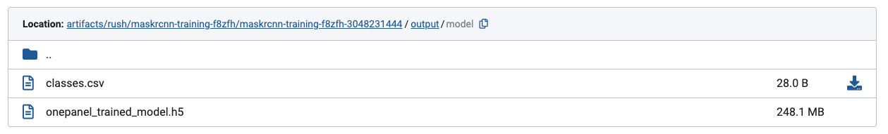
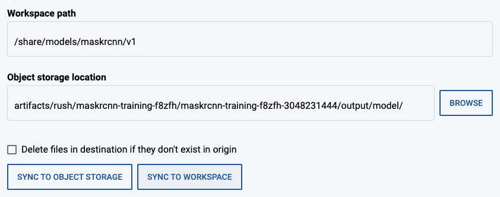
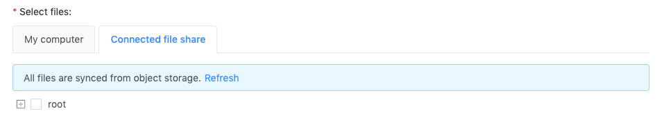
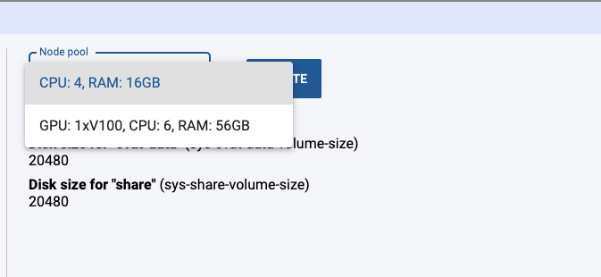
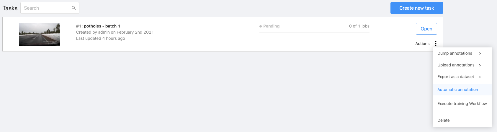
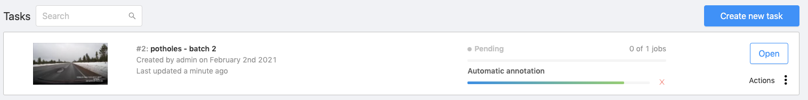
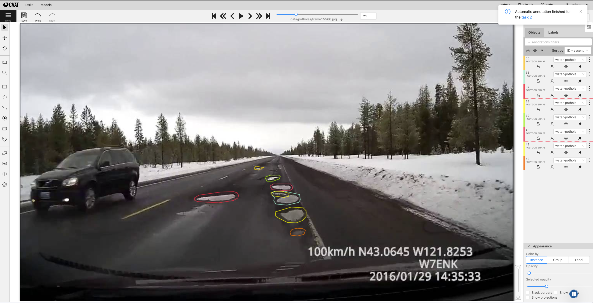

You can use your trained models to automatically pre-annotate your data. This can save you a lot of time since you don't have to annotate images from scratch. On Onepanel, you can leverage these features to pre-annotate bounding boxes or polygon masks.

## Uploading your trained model into CVAT Workspace

First, you will need to upload your trained model into CVAT.

1. First, navigate to the Workflow that you used to train your model. You can go to **Workflows** and then filter by `workspace-uid: <your-cvat-workspace-uid>`.

    

2. Click on the **train-model** task and then click **Outputs** in the task panel on the right hand side.

    

3. In the file browser, click on **output** > **model** and then click the copy icon next to the location.

    

    :::note
    The screenshot above is showing MaskRCNN model output, TensorFlow Object Detection output has a few more files and the model name is `frozen_inference_graph.pb`.
    :::

4. Return to your CVAT Workspace and click on **Models** in the top menu and then click on **Create new model** button.

5. Click on **Connected file share**.

    
  
6. Click the Onepanel icon in bottom right corner to bring up the Workspace panel. Under **Sync files**, in the **Workspace path** field, type in the path you want to sync your model data into, and then paste the path you copied above into **Object storage location** field.

    

7. Click **Sync to Workspace**, you should see a log showing data being synced. Once complete, close the **Logs** panel.

8. Click **Refresh** under **Connected file share**.

    

9.  Expand the file tree to navigate to your model folder and select **classes.csv** and **onepanel_trained_model.h5** (or **frozen_inference_graph.pb** if using TFOD).

    

10. Enter a name for your model and click **Submit**.

11. Once the model is uploaded, click **Models** to verify that it's there.

    

12. Follow the steps in the next section below to use this model for automatic annotation.

## Running automatic annotation in CVAT

1. Make sure you have uploaded your trained model as [outlined above](#uploading-your-trained-model-into-cvat-workspace).

2. (Optional but [recommended](#machine-types-and-annotation-time)) If the Workspace is on a CPU machine, switch to a GPU machine by clicking the Onepanel icon and choosing a GPU node pool from the **Node pool** dropdown and click **Update**. Once the Workspace is ready, continue to next step.

    

3. Click **Automatic annotation** under **Actions** menu for the task you want to annotate. 

  

4. Select the model you created earlier and make sure the class (label) mappings are correct.

    

5. Click **Submit** to start the annotation process.

    

6. Once complete, you can click on **Open** and click **Job #** to view annotations.

    

    :::note
    If for some reason you don't see any annotations, refresh the page and click **Open** again.
    :::

## Machine types and annotation time

See the table below which details machine type with the corresponding time to complete automatic annotation. For this test, we used a task with **3550 images (2GB)**.

Machine     | Time     
------------|---------------
1 x K80     | 160 minutes
1 x V100    | 80 minutes
4 x V100    | 21 minutes

The above data was generated for `ssd-mobilenet-v2` model which is the model we suggest to use in normal circumstances. If you have complex annotations and want to use faster-rcnn based model, then it might take slightly more time but it won’t significantly alter the data presented above.

The other factor is image compression. By default, CVAT compresses images by 50%. If you use the original images without compression, your automatic annotation time will be increased by ~5-6% of that of 50% compressed images. So in the above table, if you use images without compression and use a V100, it will take 84 minutes instead of 80 minutes.

If your data size is different from above, then you can easily extrapolate the annotation time from the above table.
