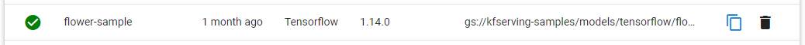

## Basic Deployment

To deploy a simple model, we can use the [flowers prediction example](https://github.com/kubeflow/kfserving/tree/master/docs/samples/v1beta1/tensorflow) from kfserving

1. To do this, go to **Models**.
	
2. Then click **New Model Server**.
	
3. Copy and paste the yaml below, filling in your namespace for &lt;namespace&gt;, then click **Create**.
	```yaml
    apiVersion: "serving.kubeflow.org/v1beta1"
    kind: "InferenceService"
    metadata:
    	namespace: <namespace>
    	name: "flower-sample"
    spec:
      predictor:
        tensorflow:
          storageUri: "gs://kfserving-samples/models/tensorflow/flowers"
	```
4. Wait for the resource to finish setting up, to confirm it's running you should see a green check as indicated.
	
5. To test the model, we can use this [jupyter notebook](https://github.com/onepanelio/python-sdk/blob/master/examples/inferenceservice-flowers.ipynb)

## Create custom model servers with the UI

In this example, we'll take a pre-existing tensorflow model and modify it to make it deployable.
As a bonus, we'll use a transformer to make the input take a base64 image and output a base64 image with the bounding boxes drawn.

We'll be using [ssd_mobilenet_v2](https://tfhub.dev/tensorflow/ssd_mobilenet_v2/fpnlite_320x320/1), an object detection model trained on COCO dataset with training images scaled to 320x320.

1. To do this you need to download the files from the link above and extract them.
2. Arrange the files as given below
   - Create a directory and give it a name, for this example we'll use `ssd`
   - In it create another directory called `0001`,  *this is for the version of the model*.
   - Move the extracted contents inside the version folder, this includes a `saved_model.pb` file and the `variables` folder.
   - For our transformer, you will also need to add a `label_map.pbtxt` file. 
     Since this model was trained under the COCO dataset, it's label maps are available [here](https://github.com/tensorflow/models/blob/master/research/object_detection/data/mscoco_label_map.pbtxt).

	Our final result is something like this:
   * ssd
     * 0001
       * saved_model.pb
       * label_map.pbtxt
       * variables
         * variables.data-00000-of-00001
         * variables.index

3. Upload files under your object storage provider ( **Azure Storage**, **S3** or **GCS** ).
4. Then go to **Models** > **New Model Server**.
5. Copy and paste the YAML below, replacing &lt;namespace&gt; with your namespace
	```yaml
  	apiVersion: "serving.kubeflow.org/v1beta1"
  	kind: "InferenceService"
  	metadata:
      namespace: <namespace>
      name: ssd # name of model server
  	spec:
      transformer:
        containers:
        - image:  onepanel/transformer-tfod-base64:v1.0.0
          name: kfserving-container
          env:
           - name: STORAGE_URI
             value: "s3://ssd/" # since Onepanel uses minio, all cloud providers can use the s3 prefix
           - name: model
             value: ssd # make sure this is the same as metadata.name
      predictor:
        tensorflow:
          runtimeVersion: "2.5.1"
          storageUri: "s3://ssd/"
	```
6. Click **Create**

7. To test the model, use this [jupyter notebook](https://github.com/onepanelio/python-sdk/blob/master/examples/deploy-and-consume-inference-api.ipynb)

## Create custom model servers with Workflows

You can also deploy models using workflows.
Using the `ssd` example above, we can replace step 5 with the following

1. Go to **Workflows** > **Workflow Templates** > **Create Template**
2. Assign template name and then under manifest paste the following:
	```yaml
  	entrypoint: main
  	templates:
      - dag:
          tasks:
            - name: deploy
              template: deploy
        name: main
      - name: deploy
        resource:
          successCondition: status.address.url
          action: create
          manifest: |
            apiVersion: "serving.kubeflow.org/v1beta1"
            kind: "InferenceService"
            metadata:
              namespace: "{{workflow.namespace}}"
              name: "{{workflow.name}}"
            spec:
              transformer:
                containers:
                - image: onepanel/transformer-tfod-base64:v1.0.0
                  name: kfserving-container
                  env:
                   - name: STORAGE_URI
                     value: "s3://ssd"
                   - name: model
                     value: "{{workflow.name}}"
              predictor:
                tensorflow:
                  runtimeVersion: "2.5.1"
                  storageUri: "s3://ssd"
	```
3. This will generate the model servers and assign names automatically.
4. Execute the workflow
