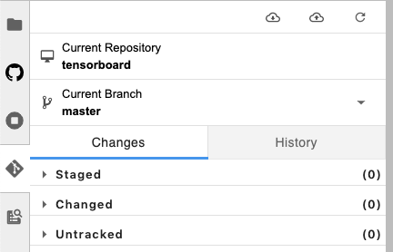

Onepanel's JupyterLab Workspace comes pre-installed with extensions for Git and GitHub so you can easily interact with both.


## Browsing GitHub
You can easily browse and execute notebooks from any public GitHub repository without cloning the repository. Just click the GitHub icon and type in the organization and name of the repository.


## Using Git

### Cloning
You can clone a Git repository by either using the JupyterLab Terminal:

```bash
# Make sure you are in the /data directory
cd /data

# Clone repository
git clone https://github.com/tensorflow/tensorboard
```

Or from the JupyterLab UI:

1. Click the Git icon.

    

2. Type in the repository URL to clone.

    

### Other Git actions
Once you clone a repository, you can either use the JupyterLab terminal or the JupyterLab UI to pull, commit, push and view Git history.

