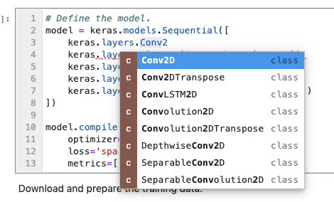
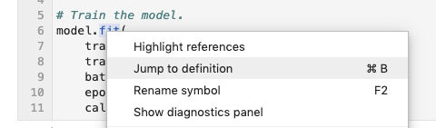
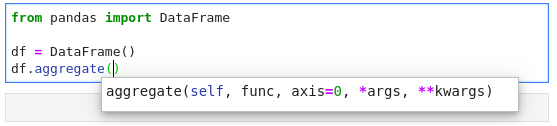
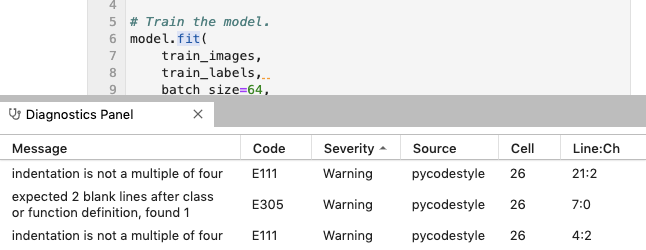

## Automatic Completion
Certain characters, for example '.' (dot) in Python, will automatically trigger completion.

## Hover
Hover over any piece of code; if an underline appears, you can press Ctrl to get a tooltip with function/class signature, module documentation or any other piece of information.

## Diagnostics
Critical errors have red underline, warnings are orange, etc. Hover over the underlined code to see a more detailed message.

## Jump to Definition
Use the context menu entries to jump to definitions.

## Automatic Signature Suggestions
Function signatures will automatically be displayed.

## Diagnostics panel
Sort and jump between the diagnostics using the diagnostics panel. Open it searching for "Show diagnostics panel" in JupyterLab commands palette or from the context menu. Use context menu on rows in the panel to filter out diagnostics or copy their message.

