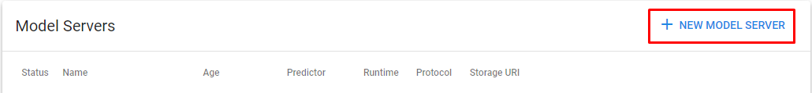
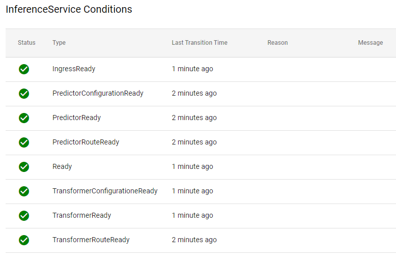

## Creating model servers using the UI
This example uses [ssd_mobilenet_v2](https://tfhub.dev/tensorflow/ssd_mobilenet_v2/fpnlite_320x320/1)
1. Download the files and extract.
2. Arrange the files as given below - these are required for KFServing to properly run.
	- Create a folder and give it a name, for this example we'll use `ssd`.

	- In it create another folder named `/0001`  which is for the version.

	- Move the extracted contents above inside the version's folder, which are `saved_model.pb` and the `/variables` folder.

	- If you are using our transformer, you will also need to add a `label_map.pbtxt` file.  
	This depends on the dataset you trained with, but given this example, it was trained under the COCO dataset, and is available [here](https://github.com/tensorflow/models/blob/master/research/object_detection/data/mscoco_label_map.pbtxt).

3. Upload files under your selected provider ( **Azure Storage**, **S3** or **GCS** ).
4. Go to **Models**.
	
5. Then click **New Model Server**.
	
6. Copy and paste this YAML
	```yaml
	apiVersion: "serving.kubeflow.org/v1beta1"
	kind: "InferenceService"
	metadata:
	  namespace: example
	  name: ssd # name of model server
	spec:
	  transformer:
	    containers:
	    - image:  andreyonepanel/transformer:image-2 # unofficial transformer image
	      name: kfserving-container
	      env:
	       - name: STORAGE_URI
	         value: "s3://ssd/" # since minio is hosted inside onepanel you can use s3 endpoint
	       - name: model
	         value: ssd # make sure this is the same as metadata.name
	  predictor:
	    tensorflow:
	      runtimeVersion: "2.5.1"
	      storageUri: "s3://ssd/"
	```
7. Remove comments from the YAML and click **Create**
8. Wait for model to be created and confirm it's ready as indicated below:
	