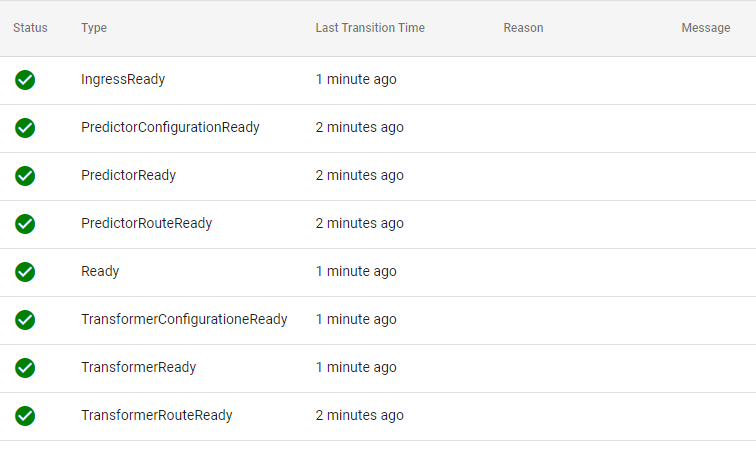

## Basic setup
Using this [flowers prediction example](https://github.com/kubeflow/kfserving/tree/master/docs/samples/v1beta1/tensorflow) from kfserving we can easily create a model server under Onepanel.
1. To do this, go to **Models**.
	
2. Then click **New Model Server**.
	
3. Copy and paste yaml then click **Create**.
	```yaml
	apiVersion: "serving.kubeflow.org/v1beta1"
	kind: "InferenceService"
	metadata:
	  name: "flower-sample"
	spec:
	  predictor:
	    tensorflow:
	      storageUri: "gs://kfserving-samples/models/tensorflow/flowers"
	```
4. Wait for the resource to finish setting up, to confirm it's running you should see a green check as indicated.
	
5. To test the model, here's an [example](https://github.com/onepanelio/python-sdk/tree/master/examples) which uses [Onepanel's python SDK](/docs/reference/sdks/python) to generate predictions.

## Create custom model servers with the UI
In this example we'll be using [ssd_mobilenet_v2](https://tfhub.dev/tensorflow/ssd_mobilenet_v2/fpnlite_320x320/1), an object detection model trained on COCO dataset with training images scaled to 320x320.
1. To do this you need to download the files and extract.
2. Arrange the files as given below - KFServing follows this setting to detect configurations among different available models.
	- Create a directory and give it a name, for this example we'll use `ssd`.

	- In it create another directory called `/0001`  *this is for the version*.

	- Move the extracted contents inside the version folder, this includes a `saved_model.pb` file and the `/variables` folder.

	- If you are using our transformer, you will also need to add a `label_map.pbtxt` file.  
	Since this model was trained under the COCO dataset, it's label maps are available [here](https://github.com/tensorflow/models/blob/master/research/object_detection/data/mscoco_label_map.pbtxt). 

:::important
Make sure to rename files and folders matching kfserving requirements.
:::

3. Upload files under your object storage provider ( **Azure Storage**, **S3** or **GCS** ).
4. Then go to **Models** > **New Model Server**.
5. Copy and paste YAML
	```yaml
	apiVersion: "serving.kubeflow.org/v1beta1"
	kind: "InferenceService"
	metadata:
	  namespace: example
	  name: ssd # name of model server
	spec:
	  transformer:
	    containers:
	    - image:  andreyonepanel/transformer:image-2 # unofficial transformer image
	      name: kfserving-container
	      env:
	       - name: STORAGE_URI
	         value: "s3://ssd/" # since minio is hosted inside onepanel you can use s3 endpoint
	       - name: model
	         value: ssd # make sure this is the same as metadata.name
	  predictor:
	    tensorflow:
	      runtimeVersion: "2.5.1"
	      storageUri: "s3://ssd/"
	```
6. Remove comments from the YAML and click **Create**
7. Wait for model to finish setting up, should return the same as follows.
	

## Create custom model servers with Workflows
1. Using the same example data uploaded to your object storage.
2. Go to **Workflows** > **Workflow Templates** > **Create Template**
3. Assign template name and then under manifest paste the following:
	```yaml
	entrypoint: main
	templates:
	  - dag:
	      tasks:
	        - name: deploy
	          template: deploy
	    name: main
	  - name: deploy
	    resource:
	      successCondition: status.address.url
	      action: create
	      manifest: |
	        apiVersion: "serving.kubeflow.org/v1beta1"
	        kind: "InferenceService"
	        metadata:
	          namespace: "{{workflow.namespace}}"
	          name: "{{workflow.name}}"
	        spec:
	          transformer:
	            containers:
	            - image:  andreyonepanel/transformer:image-2
	              name: kfserving-container
	              env:
	               - name: STORAGE_URI
	                 value: "s3://ssd"
	               - name: model
	                 value: "{{workflow.name}}"
	          predictor:
	            tensorflow:
	              runtimeVersion: "2.5.1"
	              storageUri: "s3://ssd"
	```
4. This will generate the model servers and assign names automatically.
5. Note that you can create custom definitions with your preferred predictor by updating the template indicated above.
6. You can use [kfserving examples](https://github.com/kubeflow/kfserving/tree/master/docs/samples/v1beta1) as reference.