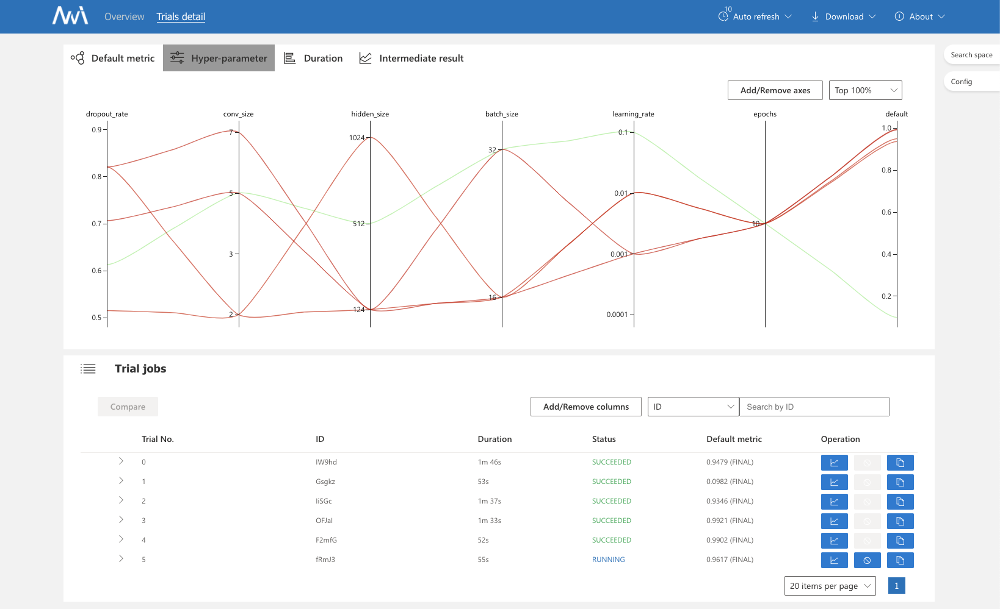
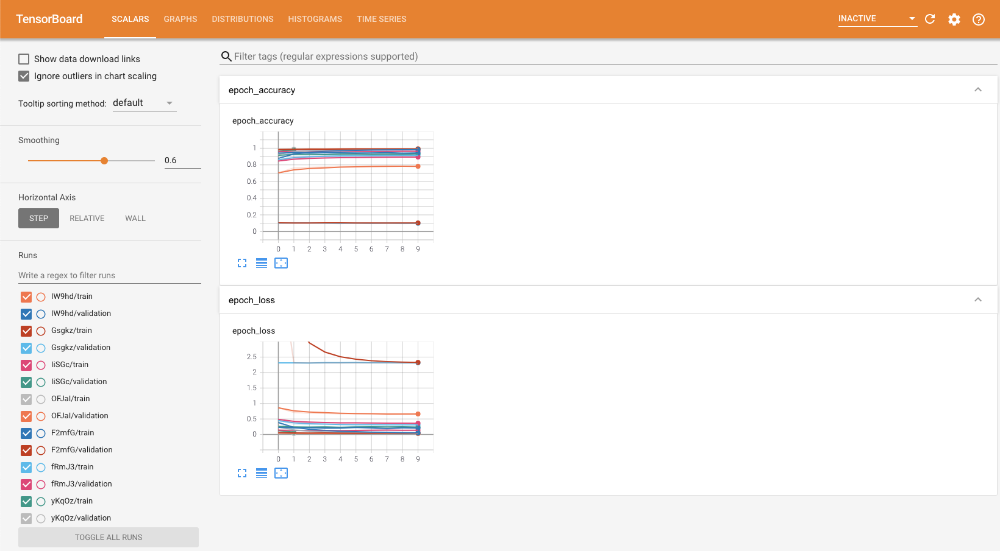

Onepanel supports hyperparameter tuning for your TensorFlow and PyTorch models by fully integrating with [NNI](https://github.com/microsoft/nni) and its [built-in tuners](https://nni.readthedocs.io/en/stable/Tuner/BuiltinTuner.html).

To understand how to add hyperparameter tuning into Onepanel Workflows, we'll walk through this [simple MNIST example](https://github.com/onepanelio/templates/tree/master/workflows/hyperparameter-tuning/mnist). Note that this example is also available when you deploy Onepanel under **Workflows** > **Workflow Templates** > **Hyperparameter Tuning Example** and also as a starter template under **Workflows** > **Workflow Templates** > **Create Template** > **Hyperparamter tuning**.

There are 4 parts to configuring hyperparameter tuning into your Workflows:

1. Model training code - Make minor updates to grab hyperparameters from NNI and report accuracies back to NNI.
2. Workflow Template - Minor changes to the clone of **Hyperparameter Tuning Example** that describes training pipeline with hyperparameter tuning.
3. Search space configuration (`search_space.json`) - The search space for hyperparameters and their corresponding ranges
4. Tuner configuration (`config.yaml`)- This is where you indicate the type of tuner (e.g. TPE), path to your model training code, whether to use GPUs, etc.

## Setting up your Workflow Template

1. First, make changes to your training code to grab the parameters from NNI and report results back to NNI. Highlighted below are all the changes we had to make to [MNIST example code](https://github.com/onepanelio/templates/tree/master/workflows/hyperparameter-tuning/mnist/main.py) to support hyperparameter tuning. The `...` indicate code that was removed for brevity.

    ```python {1,4-7,25,32,49-50}
    import nni

    # Callback class for reporting intermediate accuracy metrics.
    class ReportIntermediates(Callback):
        def on_epoch_end(self, epoch, logs=None):
            """Reports intermediate accuracy to NNI framework"""
            nni.report_intermediate_result(logs['val_accuracy'])

    def main(args, params):
        ...

        model = tf.keras.Sequential([
            ...
        ])
        model.compile(...)

        ...

        model.fit(
            x_train,
            y_train,
            batch_size=params['batch_size'],
            epochs=params['epochs'],
            # Add callback class for intermediate accuracy reporting
            callbacks=[ReportIntermediates(), tensorboard],
            validation_data=(x_test, y_test)
        )

        ...
        
        # send final accuracy to NNI tuner and web UI
        nni.report_final_result(accuracy)
        
        ...

    if __name__ == '__main__':
        ...

        params = {
            'dropout_rate': 0.5,
            'conv_size': 5,
            'hidden_size': 1024,
            'batch_size': 32,
            'learning_rate': 1e-4,
            'epochs': 10,
        }

        # fetch hyper-parameters from NNI tuner
        tuned_params = nni.get_next_parameter()
        params.update(tuned_params)

        _logger.info('Hyperparameters: %s', params)
        main(parser.parse_args(), params)
    ```

2. Go to **Workflows** > **Workflow Templates** > **Create Template** and select **Hyperparamter tuning**.

3. Update the Workflow Template to use your repository and update the paths in `/mnt/src` to match your repository's directory structure. The `...` indicate sections that were removed for brevity.
    ```yaml {6,26,31,40}
    entrypoint: main
    arguments:
        parameters:
        - name: source
          # Path to your training/model architecture code repository
          value: https://github.com/onepanelio/templates
    ...
    templates:
    - name: main
        dag:
            tasks:
            - name: hyperparameter-tuning
              template: hyperparameter-tuning
    ...
    - name: hyperparameter-tuning
      inputs:
        artifacts:
        - name: src
          # Clone the above repository into `/mnt/data/src` - see https://docs.onepanel.ai/docs/reference/workflows/artifacts#git for private repositories
          git:
            repo: '{{workflow.parameters.source}}'
            revision: '{{workflow.parameters.revision}}'
          path: /mnt/data/src
        - name: config
          # Path to where your tuner configuration (config.yaml) will be written - same directory as your training code
          path: /mnt/data/src/<path-to-training-code-directory>/config.yaml
          raw:
            data: '{{workflow.parameters.config}}'
        - name: search-space
          # Path to where your hyperparameter search space (search_space.json) will be written - same directory as your training code
          path: /mnt/data/src/<path-to-training-code-directory>/search_space.json
          raw:
            data: '{{workflow.parameters.search-space}}'
    ...
      container:
        image: onepanel/dl:0.17.0
        args:
            - --config
            # Path to config.yaml file that is written above
            - /mnt/data/src/<path-to-training-code-directory>/config.yaml
    ...
    ```

4. Update the Workflow Template title and click **Save**.

## Understanding the configurations

When you attempt to execute the hyperparameter tuning Workflow Template, you'll notice two parameters, `Configuration` and `Search space configuration`. The former is the tuner configuration and the latter is the configuration for your hyperparameters and their corresponding search spaces.

Here is a description of each of the fields in the `Configuration` parameter:

```yaml
authorName: Onepanel, Inc.          # Name of the author
experimentName: MNIST TF v2.x       # Name of experiment
trialConcurrency: 1                 # Concurrency of trials, note that if on GPU, this should match gpuNum
maxExecDuration: 1h                 # Maximum duration of each trial
maxTrialNum: 10                     # Maximum number of trials
trainingServicePlatform: local      # This should always be set to `local`
searchSpacePath: search_space.json  # Path to search_space.json file - you don't have to change this if you follow the steps above
useAnnotation: false
tuner:
    # gpuIndices: '0'               # Uncomment and update to the GPU indices to assign this tuner
    builtinTunerName: TPE           # Choices: TPE, Random, Anneal, Evolution, BatchTuner, MetisTuner, GPTuner
    classArgs:
        optimize_mode: maximize     # Choices: maximize, minimize
trial:
    command: python main.py --output /mnt/output    # Command to execute your training code
    codeDir: .
    # gpuNum: 1                     # Uncomment and update to number of GPUs
```

:::important
See [NNI's Experiment Config Reference](https://nni.readthedocs.io/en/stable/Tutorial/ExperimentConfig.html) for more information and list of all available fields.
:::

`Search space configuration` content is in JSON format and it depends on the hyperparameters you intend to use in your training code. Example from the MNIST code above is as follows:

```json
{
    "dropout_rate": { "_type": "uniform", "_value": [0.5, 0.9] },
    "conv_size": { "_type": "choice", "_value": [2, 3, 5, 7] },
    "hidden_size": { "_type": "choice", "_value": [124, 512, 1024] },
    "batch_size": { "_type": "choice", "_value": [16, 32] },
    "learning_rate": { "_type": "choice", "_value": [0.0001, 0.001, 0.01, 0.1] },
    "epochs": { "_type": "choice", "_value": [10] }
}
```


## Executing your Workflow

Now that you have set up your hyperparameter tuning Workflow Template and have a good understanding of the various configurations, you can execute the Workflow via Onepanel [Web UI](/docs/reference/workflows/execute) or [Python SDK](https://github.com/onepanelio/python-sdk/blob/master/examples/execute-workflow.ipynb). 

Once the Workflow is running, you can see your training progress in **TensorBoard** and **NNI Web UI** right from your Workflow Task by clicking on the **hyperparameter-tuning** Task, then clicking **Outputs**.


Clicking **Open NNI Web UI** will display the following screen in a new tab:



You can also view the corresponding TensorBoard by clicking **Open TensorBoard**:



## Persisting best metrics, model and hyperparameters
Although optional, you should persist the best metrics to your Workflow and save the best model and parameters to your object storage.

Refer to the [MNIST example code](https://github.com/onepanelio/templates/tree/master/workflows/hyperparameter-tuning/mnist/main.py) for an example of how to do this.

