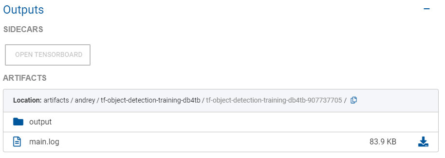

Onepanel supports the following built-in models for object detection and semantic segmentation:

- TensorFlow Object Detection API models for object detection.
- MaskRCNN model for semantic segmentation.

These models are available as training Workflows under **Workflows** > **Workflow Templates** and can be [executed from any CVAT Workspace](/docs/reference/cvat/built-in-models) to train on your annotated data.

[TensorBoard](/docs/reference/workflows/tensorboard#launching-tensorboard) is also fully integrated and along with real-time logs can be accessed while your model is training.

## TensorFlow Object Detection

You can use any of the supported TensorFlow Object Detection API models to train models on your data. Following is an overview on how to choose one model over another based on your needs. Some models are faster than others, whereas some are more accurate than others.


### TFOD hyperparameters

You can specify arguments for all the available models in TFOD in the `Hyperparameters` field in YAML format.

Here's an example:

```bash
num_steps: 10000               #  Number of steps. If left empty, Onepanel will pick the recommended defaults for that model.
batch_size: 1                  #  Batch size for the training
initial_learning_rate: 0.0003  #  Initial learning rate for the model. We recommend you do not change this.
num_clones: 1                  #  Number of GPUs to use for training. Change to number of GPUs for your machine.
``` 

See [this file](https://github.com/onepanelio/templates/blob/release-v0.18.0/workflows/tf-object-detection-training/defaults.json) for all available hyperparameters for each TFOD model. Also see [picking model parameters](https://github.com/tensorflow/models/blob/master/research/object_detection/g3doc/configuring_jobs.md#picking-model-parameters)


### Choosing the right model

- We currently support several faster-rcnn models. All of these models are similar except that of the backbone used for the feature extraction. The backbones used are, in increasing order of complexity (i.e more layers), ResNet50, ResNet101, InceptionResNetV2. As the model complexity increases the computation requirement will also increase. If you have very complicated data (i.e hundreds of annotations in one image), then it is recommended that you choose complex model (i.e InceptionResNetV2).

- Faster-rcnn models are generally more accurate than ssd models. However, sometimes you are better off using ssd models if your data is easy to learn (i.e 1 or 2 bounding box per image).

#### frcnn-nas-coco:

- If you are using `frcnn-nas-coco`, then choose a machine with at least 2 GPUs as this model requires more memory. A machine with 1 GPU will throw an error.

This is a type of faster-rcnn model with NAS backbone. If you are not sure about which model to use then we recommend you use SSD based model (i.e ssd-mobilenet-v2).

***Defaults***: batch_size: 1, learning_rate: 0.0003, epochs=10000

#### frcnn-res101-coco: 

This is a type of faster-rcnn model with ResNet101 backbone. If you are not sure about which model to use then we recommend you use SSD based model (i.e ssd-mobilenet-v2). 

***Defaults***: batch_size: 1, learning_rate: 0.0003, epochs=10000

#### frcnn-res101-lowp

This is a type of faster-rcnn model with ResNet101 backbone with low number of proposals. If you are not sure about which model to use then we recommend you use SSD based model (i.e ssd-mobilenet-v2). If you are looking for more complex and accurate model then check out frcnn-res101-coco or frcnn-inc-resv2-atr-coco.

***Defaults***: batch_size: 1, learning_rate: 0.0003, epochs=10000

#### frcnn-res50-coco

This is a type of faster-rcnn model with ResNet50 backbone. If you are not sure about which model to use then we recommend you use SSD based model (i.e ssd-mobilenet-v2). If you are looking for more complex and accurate model then check out frcnn-res101-coco or frcnn-inc-resv2-atr-coco.

***Defaults***: batch_size: 1, learning_rate: 0.0003, epochs=10000

#### ssd-mobilenet-v2-coco

SSD-based networks such as `ssd-mobilenet-v2` are faster than faster-rcnn based models. However, they are not as accurate as faster-rcnn based models. This model is generally recommended since its accurate and fast enough. If you don't know much about your data or the complexity of your data, then we recommend you go with this model.

You will find the pre-trained model and config file for ssd-mobilenetv2 model trained on COCO dataset.

This model is a good place to start if you don't have any specific model in mind. If you are data is very complicated (i.e many annotations per image) then you should prefer faster-rcnn models over ssd.

Depending upon your data, you can set epochs to train your model. There is no standard value which can work for all datasets. You generally have to try different number of epochs to get the best model. Ideally, you do so by monitoring loss of your model while training. But if you are looking for a recommendation. Then, we recommend you set epochs as follows: (number of images / batch_size (default: 24)) * 1000. For instance, if you have 100 images, then your epochs will be 4000 (rounded). Note that the model will be trained using a pre-trained model, so you don't need to train as long as you would have to when not using the pre-trained model.

***Defaults***: batch_size: 24, learning_rate: 0.004, epochs=10000

Note that same instructions apply for **ssd-mobilenet-v1** and **ssd-mobilenet-lite**. The only difference is the backbone model (i.e mobilenet v1) that they use.

## MaskRCNN

MaskRCNN is a popular model for segmentation tasks. We use [this](https://github.com/matterport/Mask_RCNN) implementation of MaskRCNN for training and inference.

The process to train a Mask-RCNN model on CVAT is similar to the above process except that you need to select Mask-RCNN after clicking on Create Annotation Model.


### MaskRCNN hyperparameters 

Even though you don't need to enter any other parameters to start the training of Mask-RCNN, it is recommended that you pass correct epochs according your data. Mask-RCNN is a very deep model which takes time to train and also to get enough accuracy.

In addition to `num_steps`, you can set epochs for three different stages of the model. These parts are called `stage_1`, `stage_2` and `stage_3` and their number of epochs can be set as follows:

```bash
stage_1_epochs: 1    #  Epochs for network heads
stage_2_epochs: 1    #  Epochs for finetune layers
stage_3_epochs: 1    #  Epochs for all layers
num_steps: 1000      #  Num steps per epoch
```

In `stage_1`, the model learns to classify from extracted features. In `stage_2`, the model learns to better extract features. In `stage_3`, the whole model changes to adapt to new data.

If you are training images that are similar to the ones in the COCO dataset, it is best to train more epochs in `stage_1`, otherwise it's best to train more epochs in `stage_2` where the model is learning to better extract features.

If you have ~1000 images, then you don't have to change any parameters.

## Fine-tuning and checkpoints

To fine-tune a model or continue from a checkpoint from previous training Workflow execution:

1. Go to a completed or failed Workflow, click the training task, and in task panel under **Outputs** > **Artifacts**, click on the output folder. If Workflow has completed successfully, click the **models** folder and copy its path. If Workflow was not successful, click the **checkpoints** folder and copy its path.
	

2. Copy the path by clicking the icon indicated below:
	

3. Click **Execute Workflow** or **Run Again** if in **Workflows**, or if in CVAT click **Execute training Workflow**, and then paste the copied path into **Checkpoint path**
	